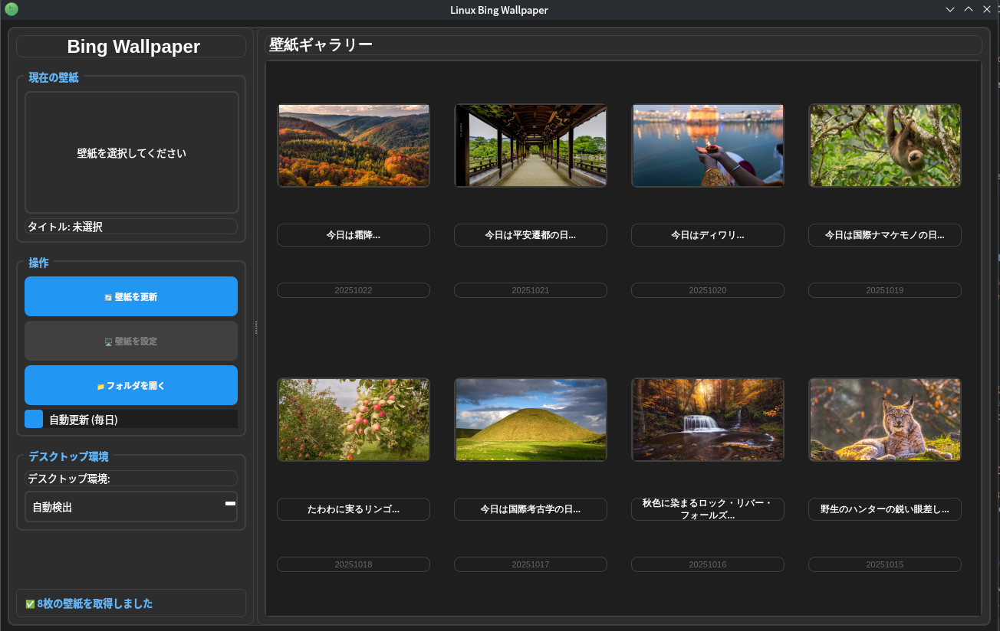

# Linux Bing Wallpaper

Linux用のBing壁紙自動取得・設定アプリケーションです。
最新のWebテクノロジー (React / Vite) と、高速で軽量なRustベースの [Tauri](https://tauri.app/) フレームワークを使用して再構築されました。


*(※スクリーンショットのパスは適宜置き換えてください)*

## 特徴

- 📸 **最新＆アーカイブ壁紙の取得**: Bingの最新壁紙およびSpotlightアーカイブから高画質の壁紙を取得します。
- 🖼️ **美しいプレビュー**: React + Tailwind CSSによるモダンなUIで壁紙のプレビューをサクサク確認できます。
- 🎨 **マルチデスクトップ環境対応**: GNOME, KDE Plasma, XFCE, COSMIC などの主要なデスクトップ環境での壁紙設定に対応（自動検出機能付き。その他の環境は `feh` による設定をサポート）。
- ⚡ **軽量・高速**: Rustバックエンドの採用により、従来のPython/PyQt6版と比べて劇的に動作が軽く、バイナリサイズも小さくなりました。

## 必要条件

ビルドおよび実行には以下の環境が必要です。

- **Node.js** (推奨: v18以上)
- **Rust / Cargo**
- **Tauri の Linux 依存関係** (WebKit2GTK など)
  - Ubuntu / Debian 系の例: 
    ```bash
    sudo apt update
    sudo apt install libwebkit2gtk-4.1-dev build-essential curl wget file libssl-dev libgtk-3-dev libayatana-appindicator3-dev librsvg2-dev
    ```

## インストールと起動

1. **リポジトリのクローン (またはディレクトリへの移動)**
   ```bash
   git clone <repository-url>
   cd LinuxBingWallpaper
   ```

2. **依存パッケージのインストール**
   ```bash
   npm install
   ```

3. **開発サーバーの起動**
   ```bash
   npm run tauri dev
   ```
   *(※Wayland環境で画面が真っ白になる場合は環境変数をつけて実行してください: `WEBKIT_DISABLE_DMABUF_RENDERER=1 npm run tauri dev`)*

4. **本番用ビルド**
   ```bash
   npm run tauri build
   ```
   ビルドが成功すると、`src-tauri/target/release/bundle/` 配下に AppImage や DEB パッケージなどが生成されます。

## 使用している主な技術スタック

- **Frontend**: React, TypeScript, Vite, Tailwind CSS, Lucide React
- **Backend**: Rust, Tauri

## ライセンス

MIT License
